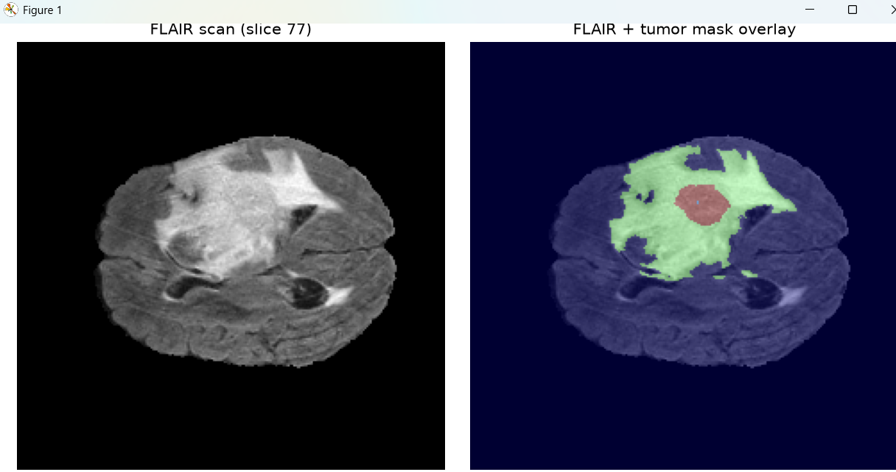
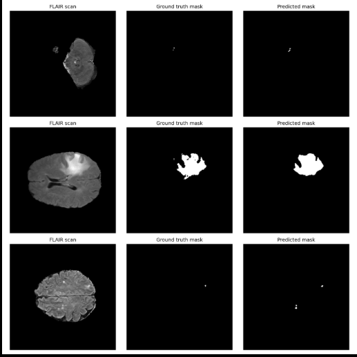
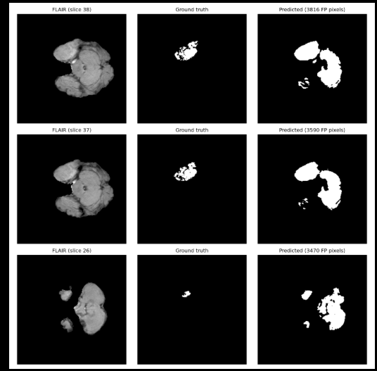

# Brain Tumor Volume Estimation from MRI using a U-Net CNN

**Predicting tumor mass from raw MRI scans by combining medical image segmentation with physical voxel geometry.**

This project takes raw 3D brain MRI scans, trains a convolutional neural network (U-Net) from scratch in PyTorch to segment brain tumors pixel-by-pixel, and converts the model's predictions into an actual physical tumor volume in mm³ — validated against ground-truth expert annotations using Dice score and mean IoU.

---

## 1. Motivation

Manually outlining a tumor's boundary on every slice of an MRI scan is slow and requires an expert radiologist. This project explores whether a CNN can learn to do that automatically, and — going a step further than a typical classification project — whether the resulting predicted mask can be converted into a genuine, clinically meaningful number: the tumor's volume in real-world units (mm³), not just a pixel count.

## 2. Dataset

**BraTS 2020** (Brain Tumor Segmentation Challenge dataset), sourced via Kaggle (`awsaf49/brats20-dataset-training-validation`).

- 3D brain MRI scans from multiple patients, each with 4 scan types (T1, T1ce, T2, FLAIR) plus an expert-drawn segmentation mask
- Each volume is 240 × 240 × 155 **voxels**, and — critically — each voxel corresponds to exactly **1mm × 1mm × 1mm** of real tissue. This 1:1 mapping is what makes converting pixel counts into real tumor volume possible.
- This project used **FLAIR** scans (a scan setting that suppresses fluid signal, making tumor tissue stand out clearly) from a **45-patient subset**, split by patient into 36 training patients and 9 test patients — patients never appear in both sets, so the model is always evaluated on brains it has never seen.

> Note: an earlier candidate dataset (a Kaggle MRI *classification* dataset with no pixel-level masks) was ruled out early on, since Dice/IoU and volume estimation both require ground-truth segmentation masks to compare against — something a classification-only dataset can't provide.

## 3. Preprocessing

- Loaded raw `.nii` (NIfTI) 3D volumes using `nibabel`
- Standardized each scan's pixel intensities (z-score: subtract mean, divide by standard deviation), computed **only over brain tissue** (excluding the black background) so background zeros don't distort the statistics
- Reduced the ground-truth mask to a binary "tumor / not tumor" mask (merging the dataset's 3 separate tumor sub-region labels into one target)
- Kept only 2D slices that actually contain tumor for training (skipping tumor-free slices), yielding 2,385 training slices and 602 test slices from the 45-patient subset

## 4. Model: U-Net (built in PyTorch)

A U-Net is the standard CNN architecture for image segmentation. Unlike a classification CNN (which shrinks an image down to a single label), U-Net needs to output a full-resolution mask — a prediction for every pixel — so it has two halves:

- **Encoder (downsampling path):** repeatedly shrinks the image while learning increasingly abstract features (*what* is in the image)
- **Decoder (upsampling path):** grows the representation back to full image size (*where* things are)
- **Skip connections:** pass fine spatial detail directly from each encoder stage to its matching decoder stage, so the network doesn't lose precise boundary detail during the shrink-then-grow process — this is the defining trick that makes U-Net work well for segmentation specifically

## 5. Training

- Loss function: Binary Cross-Entropy (BCE) — standard choice for a per-pixel yes/no classification problem
- Optimizer: Adam, learning rate 1e-3
- 15 epochs, CPU-only training
- Training loss dropped steadily throughout (0.036 → 0.005), while validation loss bottomed out around epoch 4 and then plateaued/rose slightly — a textbook sign of **overfitting** past that point. Documented as a known limitation rather than hidden; early stopping is a natural next step (see Section 8).

## 6. Segmentation Results

| Metric | Score |
|---|---|
| Mean Dice score | 0.7251 |
| Mean IoU | 0.6332 |

Dice and IoU both measure mask overlap between prediction and ground truth (0 = no overlap, 1 = perfect overlap); IoU is a stricter variant of the same idea.


*A FLAIR MRI slice (left) and the same slice with the expert-drawn tumor mask overlaid (right) — red is tumor core, green is surrounding edema (swelling).*


*Three test slices: FLAIR scan, ground truth mask, and the model's predicted mask. The model performs strongly on clear, sizeable tumor regions (middle row); its weakest cases are thin "edge" slices where the tumor is barely present.*

## 7. Tumor Volume (Mass) Estimation

Since each voxel = 1mm³, summing predicted tumor voxels across every slice of a patient's volume gives a real tumor volume estimate in mm³, directly comparable to the ground-truth volume computed the same way.

| | Value |
|---|---|
| Mean volume estimation error (9 test patients) | 55.1% |
| **Median** volume estimation error | **8.7%** |

The large gap between mean and median is itself a finding: one outlier patient distorted the average. 8 of 9 test patients had volume errors between 0.2% and 32%, with one patient (008) at 371.8% error, single-handedly pulling the mean up. The median is the more honest "typical performance" number.

### Investigating the outlier


*Patient 008's three worst slices. Ground truth shows small scattered tumor speckles; the model instead predicted one large solid blob covering a bright-looking brain structure. The model appears to have learned a "large bright region = tumor" shortcut that misfires when normal tissue is unusually bright.*

## 8. Limitations and Future Work

- **Scale:** trained on 45 patients (36 train / 9 test) out of the full ~369-patient BraTS2020 dataset, due to CPU-only, no-GPU hardware constraints. More data and more compute would be expected to close the gap to published BraTS benchmarks (typically 0.85–0.90 Dice).
- **Overfitting after epoch ~4:** early stopping or a validation-based checkpoint selection would likely improve generalization.
- **False positives on atypical scans (patient 008):** per-patient z-score normalization may distort scans with unusual intensity distributions; global normalization statistics or intensity clipping are candidate fixes.
- **2D slice-based approach:** the model processes each 2D slice independently; a true 3D U-Net (operating on the whole volume at once) could capture cross-slice context that this approach misses, at the cost of significantly higher compute requirements.
- **Single scan type:** only FLAIR was used; incorporating all four scan types as separate input channels is a natural extension.

## 9. Tech Stack

- **Python 3.11**
- **PyTorch** — CNN model and training loop
- **nibabel** — reading `.nii` medical imaging files
- **NumPy** — array operations, preprocessing
- **Matplotlib** — visualization

## 10. Project Structure

```
Brain-Tumor-Segmentation/
├── extract_subset.py          # Selectively extracts N patients from the BraTS zip
├── preprocess_split.py        # Standardizes scans, patient-based train/test split
├── model.py                   # U-Net architecture definition
├── train_full.py               # Training loop, saves trained model weights
├── evaluate.py                 # Dice/IoU scoring + prediction visualization
├── volume_estimation.py        # Converts masks to mm³ tumor volume, compares to ground truth
├── investigate_patient_008.py  # Slice-level false-positive investigation
├── processed_data/             # Saved .npy arrays (train/test images & masks)
└── unet_brain_tumor.pth        # Trained model weights
```
